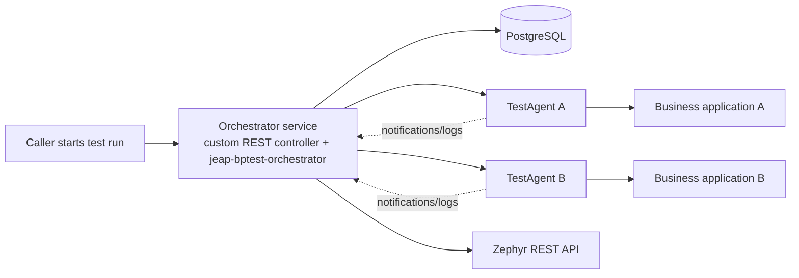
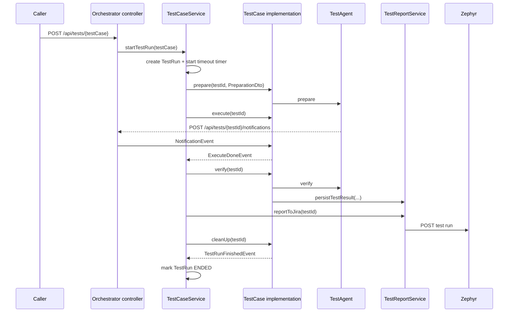

# Architecture

A business process test orchestrator coordinates several application-specific test agents, stores the test-run state,
and reports the result to Zephyr. The test agents act as a thin automation boundary around the applications under test.

## Components

- **Orchestrator service**: your Spring Boot application built on this library.
- **Business applications**: the systems under test.
- **Test agents**: companion services implementing the separate `jeap-bptestagent-api` contract.
- **Zephyr / Jira**: destination for aggregated test-run results.
- **PostgreSQL**: persistence for test cases, test runs, logs, parameters, and reports.

## Lifecycle and event flow

`TestCaseService` drives the lifecycle. A custom test case bean implements the orchestration logic and advances the flow
through Spring application events.

If a test-agent call fails or times out, `TestAgentWebClient` throws `TestAgentException`. `TestCaseService` or the
async exception handler aborts the run, attempts verification if possible, reports the failure, and still triggers
cleanup.

## Domain model

The persisted domain model consists of:

- `TestCase`: name, Jira project key, Zephyr test-case key.
- `TestRun`: one execution with state `STARTED`, `ENDED`, or `ABORTED`; start/end timestamps; environment; parameters;
  logs; and optional report.
- `TestReport`: detail text plus a collection of `TestResult` entries.
- `TestResult`: one verification step with `PASS`, `FAIL`, or `NO_RESULT`.
- `TestLog`: log level, message, source, and timestamp for agent callback logs.

`TestCaseService` creates `TestCase` rows lazily on first execution. `TestRunService` owns test-run state changes and
parameter storage. `TestReportService` converts aggregated results into Zephyr's payload shape.

## Modules

This repository contains two Maven modules:

- `jeap-bptest-orchestrator`: the actual library.
- `jeap-bptest-orchestrator-instance`: a POM-only parent for downstream orchestrator service instances.

The library auto-registers its JPA, services, test-agent, Zephyr, async, and metrics configuration through Spring Boot
`AutoConfiguration.imports`.

## Relation to `jeap-bptestagent-api`

The TestAgent REST contract is not defined in this repository. It comes from the separate `jeap-bptestagent-api`
library, which both sides share:

- Test agents implement the API.
- The orchestrator calls it through `TestAgentWebClient`.
- Callback DTOs such as `NotificationDto` and `LogDto` also come from that shared API library.

See [TestAgent API contract](test-agent-api.md) for the operations.

## Related pages

- [Getting started](getting-started.md)
- [Configuration reference](configuration.md)
- [Test-case lifecycle](test-case-lifecycle.md)
- [Zephyr reporting](reporting.md)
- [Metrics UI](metrics.md)
